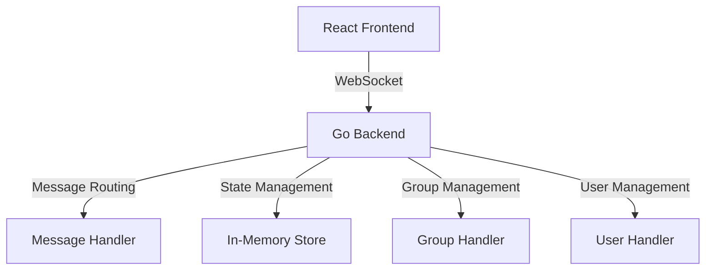
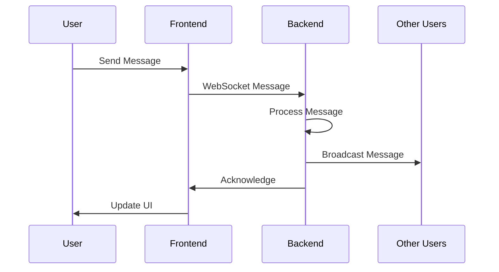

# Building a Real-Time Chat Application with Go and React: A Comprehensive Guide


In today's digital world, real-time communication is essential. Whether it's for team collaboration, customer support, or social networking, having a reliable chat application is crucial. In this article, we'll explore how to build a modern, real-time chat application using Go for the backend and React for the frontend.

## Table of Contents
- [Introduction](#introduction)
- [Architecture Overview](#architecture-overview)
- [Key Features](#key-features)
- [Technical Implementation](#technical-implementation)
- [Frontend Design](#frontend-design)
- [Backend Architecture](#backend-architecture)
- [Real-Time Communication](#real-time-communication)
- [Security Considerations](#security-considerations)
- [Conclusion](#conclusion)

## Introduction

Our chat application is a full-featured messaging platform that supports both private and group conversations. It's built with modern technologies and follows best practices for real-time communication. The application features a clean, intuitive user interface and robust backend architecture.

## Architecture Overview

The application follows a client-server architecture with a focus on real-time communication and scalability. Let's break down the key components:

### System Architecture



### Frontend Architecture

The frontend is built using React with a component-based architecture:

1. **Context Layer**
   - WebSocket Context for real-time communication
   - State management using React Context API
   - Custom hooks for WebSocket operations

```javascript
// WebSocket Context Structure
const WebSocketContext = createContext(null);

export const WebSocketProvider = ({ children }) => {
  // State Management
  const [isConnected, setIsConnected] = useState(false);
  const [username, setUsername] = useState('');
  const [users, setUsers] = useState([]);
  const [groups, setGroups] = useState({});
  const [messages, setMessages] = useState([]);
  
  // WebSocket Reference
  const wsRef = useRef(null);
  
  // Message Handling
  const handleMessage = useCallback((message) => {
    // Message processing logic
  }, []);
  
  // Connection Management
  const connect = useCallback(() => {
    // Connection setup
  }, []);
};
```

2. **Component Layer**
   - Chat component for message display
   - User/Group list components
   - Message input component
   - Group management components

### Backend Architecture

The Go backend is designed for high performance and scalability:

1. **Connection Management**
```go
type Client struct {
    conn     *websocket.Conn
    username string
    send     chan []byte
}

var (
    clients    = make(map[*Client]bool)
    broadcast  = make(chan []byte)
    register   = make(chan *Client)
    unregister = make(chan *Client)
)
```

2. **Message Types and Routing**
```go
const (
    TypePrivateMessage = "private_message"
    TypeGroupMessage   = "group_message"
    TypeCreateGroup    = "create_group"
    TypeAddMember      = "add_member"
    TypeRemoveMember   = "remove_member"
    TypeUserList       = "user_list"
    TypeGroupList      = "group_list"
    TypeHistory        = "history"
    TypeSystem         = "system"
    TypeUnreadCount    = "unread_count"
)
```

3. **State Management**
   - In-memory storage for active sessions
   - Message history tracking
   - User presence management
   - Group state management

### Data Flow

1. **Message Flow**


2. **State Synchronization**
   - Real-time user presence updates
   - Message history synchronization
   - Group state management
   - Unread message tracking

### Communication Protocol

The application uses a custom message protocol over WebSocket:

```javascript
// Message Structure
{
  type: string,      // Message type
  from: string,      // Sender username
  to: string,        // Recipient/Group
  content: string,   // Message content
  timestamp: string  // ISO timestamp
}
```

### Error Handling and Recovery

1. **Connection Recovery**
   - Automatic reconnection attempts
   - Connection state monitoring
   - Error logging and reporting

2. **Message Recovery**
   - Message queuing
   - Delivery status tracking
   - Error handling and retry logic

### Performance Considerations

1. **Frontend Optimization**
   - React.memo for component optimization
   - useCallback for function memoization
   - Efficient state updates
   - Virtual scrolling for message lists

2. **Backend Optimization**
   - Goroutine-based concurrency
   - Efficient message routing
   - Memory management
   - Connection pooling

### Scalability Features

1. **Horizontal Scaling**
   - Stateless backend design
   - Shared message store
   - Distributed user sessions

2. **Load Balancing**
   - WebSocket connection distribution
   - Message queue management
   - Resource allocation

## Key Features

### 1. Real-Time Messaging
- Instant message delivery
- Support for both private and group chats
- Message history persistence
- Typing indicators
- Message delivery status

### 2. User Management
- User authentication
- Online/offline status
- Last seen timestamps
- User presence indicators

### 3. Group Chat Functionality
- Create and manage groups
- Add/remove group members
- Group message broadcasting
- Group member management

### 4. Message Features
- Unread message counts
- Message timestamps
- Message delivery status
- Message history
- Real-time updates

## Technical Implementation

### Frontend Design

The frontend is built using React and Material-UI, providing a modern and responsive user interface. Key components include:

```javascript
// Chat component structure
const Chat = () => {
  const {
    username,
    users,
    groups,
    messages,
    selectedChat,
    setSelectedChat,
    sendMessage,
    createGroup
  } = useWebSocket();
  
  // Component implementation
};
```

The UI is divided into three main sections:
1. User/Group List
2. Chat Area
3. Message Input

### Backend Architecture

The Go backend handles WebSocket connections and message routing:

```go
// WebSocket message types
const (
    TypePrivateMessage = "private_message"
    TypeGroupMessage   = "group_message"
    TypeCreateGroup    = "create_group"
    TypeAddMember      = "add_member"
    TypeRemoveMember   = "remove_member"
)
```

Key backend features:
- Concurrent message handling
- Message persistence
- User session management
- Group management
- Real-time updates

## Real-Time Communication

The application uses WebSocket for real-time communication, ensuring instant message delivery and updates. The implementation includes:

1. **Connection Management**
   - WebSocket connection establishment
   - Connection state monitoring
   - Automatic reconnection

2. **Message Handling**
   - Message routing
   - Message persistence
   - Delivery status tracking

3. **State Synchronization**
   - User presence updates
   - Message history synchronization
   - Group state management

## Security Considerations

The application implements several security measures:

1. **Authentication**
   - Username validation
   - Session management
   - Connection security

2. **Message Security**
   - Message validation
   - Access control
   - Rate limiting

3. **Data Protection**
   - Input sanitization
   - Error handling
   - Secure communication

## Frontend Design Details

The chat interface is designed with user experience in mind:

1. **Layout**
   - Responsive design
   - Clean, modern interface
   - Intuitive navigation

2. **Features**
   - Real-time message updates
   - Unread message indicators
   - Message timestamps
   - User presence indicators

3. **User Interface**
   - Material Design components
   - Custom styling
   - Responsive layout
   - Accessibility features

## Backend Architecture Details

The Go backend is designed for scalability and performance:

1. **Message Handling**
   - Concurrent message processing
   - Message queuing
   - Delivery guarantees

2. **State Management**
   - In-memory state
   - State synchronization
   - Error recovery

3. **Performance Optimization**
   - Connection pooling
   - Message batching
   - Resource management

## Conclusion

Building a real-time chat application requires careful consideration of various aspects, from user interface design to backend architecture. Our implementation demonstrates how to create a robust, scalable, and user-friendly chat application using modern technologies.

Key takeaways:
- WebSocket provides efficient real-time communication
- React and Material-UI enable modern UI development
- Go offers excellent performance for backend services
- Proper architecture ensures scalability and maintainability

The application can be extended with additional features like:
- Message encryption
- File sharing
- Voice/video calls
- Message search
- User profiles

## Next Steps

To further improve the application, consider:
1. Implementing end-to-end encryption
2. Adding file sharing capabilities
3. Integrating with external services
4. Implementing message search
5. Adding user profiles and avatars

## Resources

- [Go Documentation](https://golang.org/doc/)
- [React Documentation](https://reactjs.org/docs/getting-started.html)
- [WebSocket Protocol](https://developer.mozilla.org/en-US/docs/Web/API/WebSockets_API)
- [Material-UI Documentation](https://mui.com/getting-started/usage/)

---

*This article was written as part of a project to build a real-time chat application. The code and implementation details are based on actual development experience.*

*Feel free to reach out for any questions or suggestions!* 